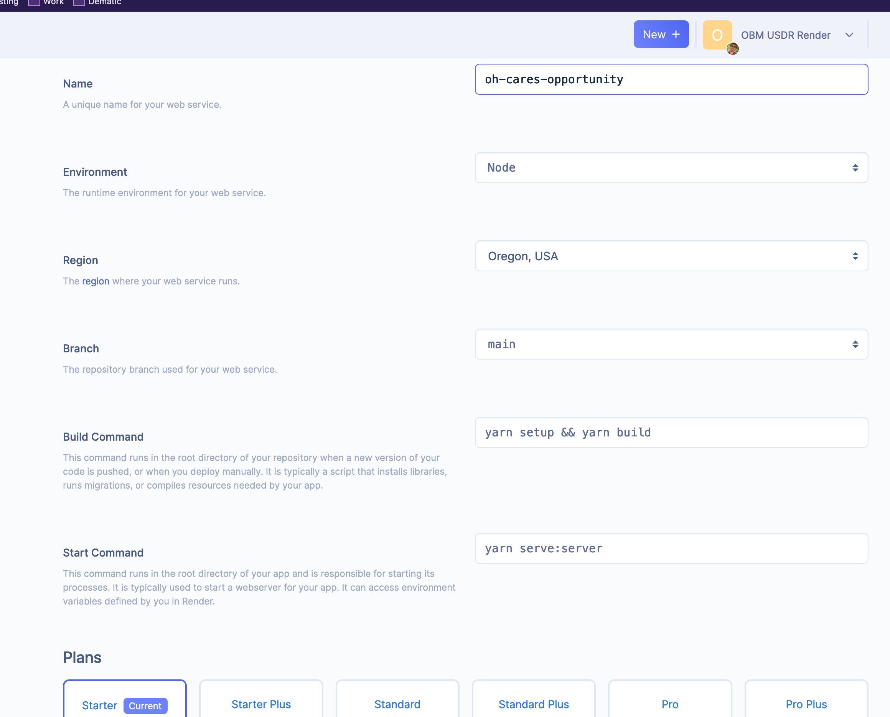
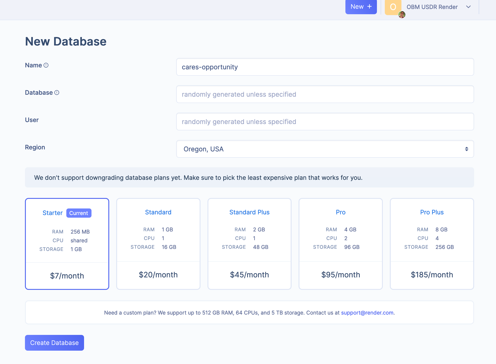
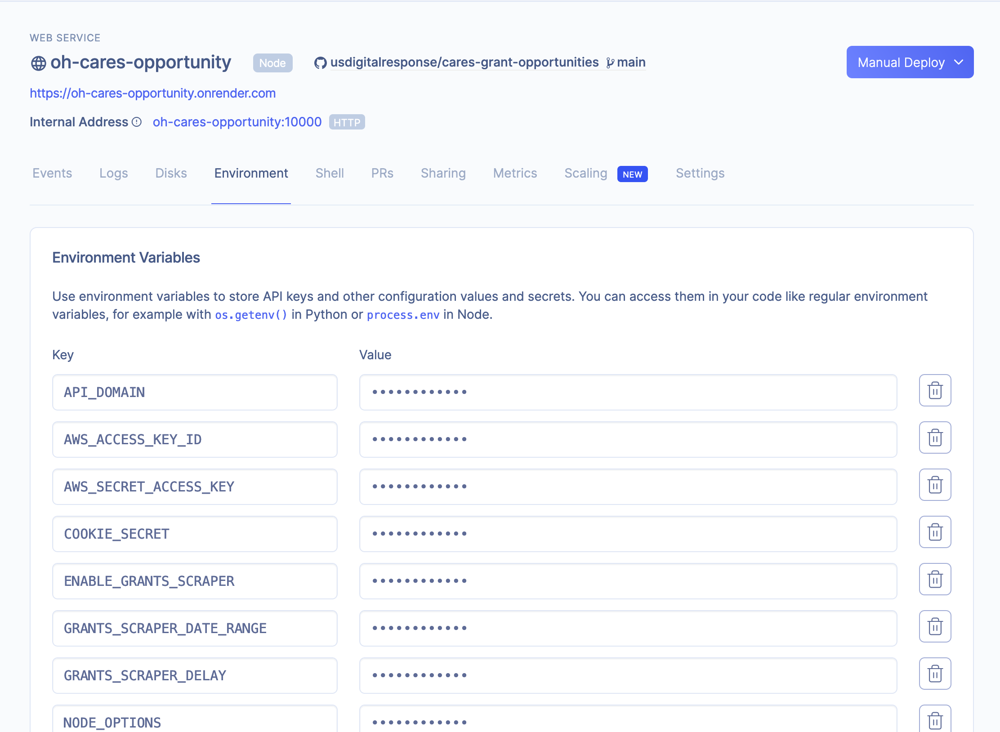

# CARES Grant Opportunities

# Project structure

```
├── packages                                    # Yarn workspace
│   ├── client                                  # Vue App
│   └── server                                  # Node server
│       ├── migrations                          # db migrations
│       └── seeds                               # db seeds
│       └── knexfile                            # knex configuration
```

Each folder inside packages/ is considered a workspace. To see a list of all worskpaces, run the following

`yarn workspaces info`

# Setup

To setup your workspace run the following commands at the root of the project

```
npm i yarn@^1.22.4 -g
yarn run setup
```

The scripts will install yarn and download npm dependencies for all yarn workspaces.

Install postgres DB. I personally used https://postgresapp.com/

Create database called cares_grant.

```
psql -h localhost -p 5432
> CREATE DATABASE cares_grant;
```

Create .env file in server workspace based on the .env.example. See Deployment section for more information on the .env file.

Set environment variable pointing to local postgrest DB, this is used for migrations

`export POSTGRES_URL="postgresql://localhost:5432/cares_grant"`

In server workspace, run migrations

`npx knex migrate:latest`

In server/seeds/dev/index.js, update the adminList by adding a user with your email to be able to login to the system. Then run migrations

`npx knex seed:run`

After that you should be able to serve the backend and frontend by running in both server and client folders.


`yarn run serve`

## Yarn Workspaces

Workspaces optimizes our repo by hoisting all of our separate node_modules/ to the root level meaning that a single yarn install command installs the NPM modules for all services

https://classic.yarnpkg.com/en/docs/workspaces/

## Lerna

Lerna helps us manage our packages, publish them, and keeps track of the dependencies between them. For example, it is used to run linting, deploy, and test scripts for each package from the root of the project.

Example usages

`npx lerna bootstrap` - recursive yarn install

`npx lerna run --scope server --stream start`

## Adding dependencies

### To add dependencies to one workspace

`npx lerna add {modules} --scope="{workspace_name}"` - where workspace_name is the name in package.json. Run `yarn workspaces info` to see a list of packages

    Example `npx lerna add uuid --scope="server" --dev`

Or you can run yarn inside the workspace

`yarn add {modules}`

### Add dependencies to multiple packages

`npx lerna add {modules}`

NOTE: yarn complains about incompatibility of some node modules with our node version (10.14). When using yarn, pass `--ignore-engines` when doing `yarn add/remove`. I have not been able to pass this argument when running `npx lerna add..`. After running lerna do a `yarn run bootstrap` at the root of the project to get your dependency correctly installed.

## Linting

### VSCode

Install the eslint plugin https://marketplace.visualstudio.com/items?itemName=dbaeumer.vscode-eslint

After that you should be able to see eslint prompts in js files

For linting on auto save: 
- Go to VSCode settings
  - Shift + Command + P
  - Search for settings
  - Select "Open Settings (JSON)"
- Paste the following snippet
```
"editor.formatOnSaveMode": "modifications",
  "editor.formatOnSave": true,
  "editor.codeActionsOnSave": {
    "source.fixAll.eslint": true
}
```

Note: Before Pasting check if there are any conflicting settings regarding esling or formatOnSave

Sharing my complete VSCode Setting
```
{
  "terminal.integrated.shell.osx": "/bin/zsh",
  "azureFunctions.showProjectWarning": false,
  "window.zoomLevel": 0,
  "diffEditor.ignoreTrimWhitespace": false,
  "azureFunctions.showCoreToolsWarning": false,
  "editor.columnSelection": false,
  "editor.find.cursorMoveOnType": true,
  "editor.formatOnSaveMode": "modifications",
  "editor.formatOnSave": true,
  "editor.codeActionsOnSave": {
    "source.fixAll.eslint": true
  }
}
```

### IntelliJ

After installing depedencies, IntelliJ should start using eslint automatically:

> By default, IntelliJ IDEA marks the detected errors and warnings based on the severity levels from the ESLint configuration
https://www.jetbrains.com/help/idea/eslint.html#ws_js_linters_eslint_install

# Deployment

## Render

1. Create web service



2. Create database



3. Update web service environment variables



```
POSTGRES_URL=<POSTGRE_CONNECTION_STRING> # Render Internal connection string ie postgres://cares_opportunity_user:<pass>@<domain>/cares_opportunity_1e53

COOKIE_SECRET=<RANDOM_ALPHANUMERIC_SECRET>

API_DOMAIN=<WEB_SERVICE_URL> # Render web service url ie. https://cares-grant-opportunities-qi8i.onrender.com
VUE_APP_GRANTS_API_URL=<WEB_SERVICE_URL> # ie. https://cares-grant-opportunities-qi8i.onrender.com

STATE_NAME=Nevada
NODE_ENV=development or production or test

NOTIFICATIONS_EMAIL="grants-identification@usdigitalresponse.org"
SES_REGION="us-east-1"
AWS_ACCESS_KEY_ID=<AWS_ACCESS_KEY_ID>
AWS_SECRET_ACCESS_KEY=<AWS_SECRET_ACCESS_KEY>

ENABLE_GRANTS_SCRAPER=true
GRANTS_SCRAPER_DATE_RANGE=7 # date range of grants that will be scraped
GRANTS_SCRAPER_DELAY=1000 # delay in milliseconds for scraper

NODE_OPTIONS=--max_old_space_size=1024 # increase node max memory, had problems with node not using all of renders server memory. This will depend on the plan
```

## DB Migrations

1. Get the postgres external connection string from render. Set it as an environment variable

`export POSTGRES_URL="postgres://user:{pass}@{domain}/{db}?ssl=true"`

NOTE: must add `?ssl=true`

2. Change directory to packages/server

3. Update seeds/dev files accordingly
   - seeds/dev/ref/agencies.js - list of agencies to be created. You can update this with the state provided agency. Note: We add a special USDR agency for our accounts in the system
   - seeds/dev/index.js - Update the admin list variable accordingly
4. Run the following commands

```
npx knex migrate:latest 
npx knex seed:run
```

After that you should be able to access the site and login with the users set in the migration.