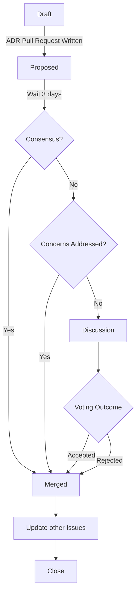

# 1. Decision Record Process

Date: 2023-04-24
Status: proposed

## Context and Problem Statement

We need to document technical decisions we make on this project for the benefit of future contributors.

## Decision Drivers

- **Clarity** - Identify historical reasoning behind decision-making
- **Transparency** - Make decisions in the open
- **Currency** - ADRs reflect the current state of the world, but can be superseded by later decisions. The highest-numbered ADR reflects the most recent decision around a given topic.
- **Expediency** - We need good decisions, but good good software ships frequently. To balance these two factors, the ADR ensures we move forward in an informed way, but provides a way to self-correct as the world changes.

## Considered Options

- ADRs on Github
- Informal Conversations
- Unilateral decision-making
- Documenting technical decisions on Notion

## Decision Outcome

Below, we describe a way to use Github to write, discuss, and store decisions in the form of markdown files known as ADRs directly within the repository.

### What is an ADR?

An Architecture Decision Record is a text file, with a particular format, and an associated discussion. It is numbered for easy reference, and it has a general format.

### When Should I Create an ADR?

As outlined by Michael Nygard, ADRs represent "architecturally significant" decisions.

The subject of an ADR should affect one of the following areas:

- Structure
- Dependencies
- Interfaces
- Construction techniques

Small changes don't need one, but for larger changes that would introduce a new dependency or affect our overall system architecture, we recommend opening one.

### Process

Please see the below diagram:

1. **Start**: To create a new ADR, copy [./templates/template.md](./templates/template.md) into a new file in this directory, named `XXXX-name-of-issue.md` where the `XXXX` part is incremented from the previous ADR. (You can also use [adr-tools](https://github.com/npryce/adr-tools))

1. Fill out all fields, set status to `proposed`, and open a pull request. Begin the pull request with `[PROPOSAL]` to clarify purpose.
   1. We recommend [Mermaid](https://mermaid-js.github.io) for diagrams! You can simply add a code block of type `mermaid` and it will be picked up automatically.
   1. If you need to store other files, create a folder with the name `XXXX-files` and put supporting ADR material there.

1. **Wait** Wait for 3 days. In the event of consensus within the expressed timeline, assign an approver and merge.

1. **Concerns** If there are concerns raised in this time period, ensure that those that disagree understand the reasoning behind the decision and address concerns with specific mitigation steps. Request confirmation that concerns have been addressed. If so, merge!

1. **Discuss** In the event that disagreement persists, discuss the decision with the group in the next weekly sync. Take a vote on next steps (opt-outs are OK!), and move forward.

1. **Merge**

   1. If the proposal is **approved** by this vote, set its status to `approved`, and merge the change.
   2. If it is **rejected**, set its status as `rejected`, and merge anyway for future reference!

1. **Update Other Issues** If people agree in discussion that this issue supersedes another, set the status of the other issue to `superseded`

1. **Close** Close the issue

### Positive Consequences

- Clarity on decisions
- A history of all decisions made on the project
- Inclusion of community voices in discussion of important topics

### Negative Consequences

- Folks have to follow a more involved process
- Might slow things down in the event of major disagreements

## Pros and Cons of Other Options

### Informal Conversations

- Pros: Easier, Faster
- Cons: Can leave people out

### Unilateral Decision Making

- Pros: The fastest option
- Cons: Many - less participation and inclusion, fewer perspectives.

### Documenting technical decisions on Notion

- Pros: Other documentation is on Notion
- Cons: Notion is private, and not everyone has access; Version control is more difficult; Comments are more difficult; code can get out of sync with documentation

## Links <!-- optional -->

- Documentation on the MADR [template](https://github.com/adr/madr)
- Blog [post](https://cognitect.com/blog/2011/11/15/documenting-architecture-decisions.html) introducing ADRs
