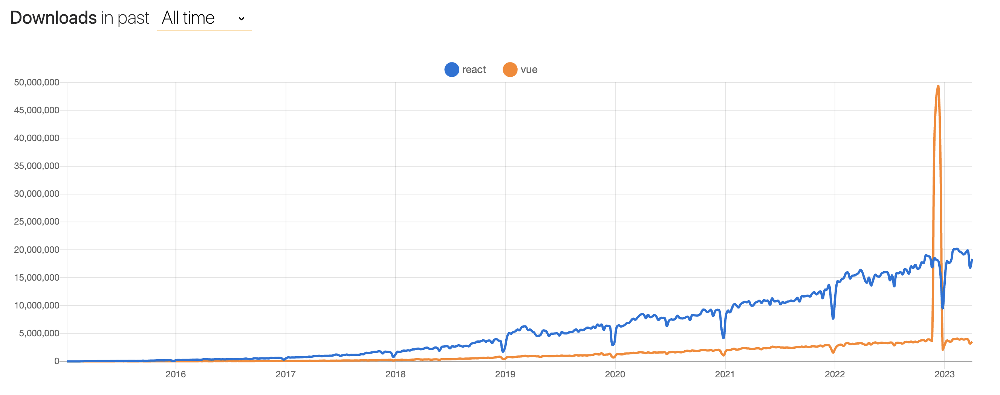
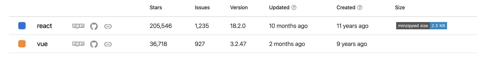
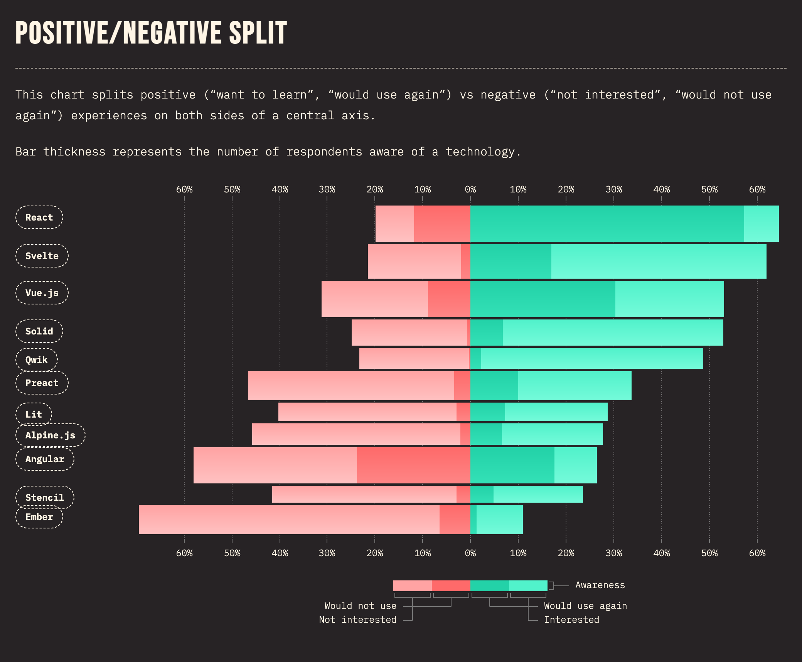

# 2. Use React for Frontend Development

**Date**: 2023-05-02

**Status**: proposed <!-- Proposed | Accepted | Rejected | Superceded -->

**Proposer**: Nat Hillard

## 👀 Context and Problem Statement

> What problem are we solving? Who asked for it? Why is it important? When do they experience this issue? What data, research and feedback do we have that explains this problem?

If there are any documents that our partners have sent over, drop them here (if you drag it over the page, Notion will automatically upload and host the document.)
>
- **Upcoming UX changes:** We’ve got substantial changes coming to a number of screens, as well as new screens, as documented [here](https://www.notion.so/Design-Efforts-Grants-2-0-MVP-2ddb9e87f33f4df0921b84d34f370e05) and [here](https://www.notion.so/Grants-2-0-Redesign-effort-bef835d692f74b289342ef4d7ef91783).
- **Upgrade cost:** We would need to invest not-insubstantial time anyway in updating various Vue-ecocystem tooling to latest versions / past already-deprecated alternatives. We are stretching the bounds of our current technical stack, which appears to last have had a major upgrade several years ago, as you can see in the FE audit [here](Frontend%20Audit%207cba74ebf5aa4cb49619ee8d338af2fe.md). Specifically:
  - Vue2 is going EOL by EOY 2023, as outlined in a ticket [here](https://github.com/usdigitalresponse/usdr-gost/issues/1106). If we were to stay with Vue, we would need to at least upgrade to the Migration Build, and then make semi-substantial changes to support Vue 3. This was apparently attempted initially a little more than a year ago [here](https://github.com/usdigitalresponse/usdr-gost/issues/45), but the code has changed a fair amount since.
  - The app uses vue-cli which has been deprecated in favor of Vite
  - The app uses vuex for state management which has been deprecated in favor of Pinia
  - We are not using typescript anywhere (though arguably this is a bigger problem on the BE, it still affects FE)
  - Testing is quite bad on the FE. We are using Mocha for testing, there is no snapshot testing, there is no storyboard, and FE tests have very poor coverage in general.
  - There are likely many more of these reasons which we should write out somewhere - the above just covers FE, but there are a number of BE concerns also
- **Stability:** There is still a fair amount of volatility in the Vue ecosystem - the Vue2->3 migration was substantial, and tooling has gone through several revisions now, resulting in our original 2-year-old stack now being largely deprecated. Though in the React world, hooks were a relatively large shift (now several years ago), and recent forays into SSC are verging on experimental, if we stick to mainline React development and standard, well-used libraries it is at least my contention that we would likely need fewer substantial shifts in the future as compared to Vue.
- **Tooling:** React has an ecosystem of tooling that has been built up to support development, testing, deployment, etc. Though many of these tools also support Vue, and/or there are Vue alternatives, these are lesser-used
- **Larger user-base:** We need to be able to draw from a large pool of potential volunteers, and a more popular library helps with this

## 🚗 Decision Drivers

> What factors are important when making this decision? Think in the context of our product and audience.
>
- **Design-Fit:** Ability to cater to upcoming designs
- **Upgrade Cost:** Time to upgrade to latest versions
- **Stability:** likelihood that we would need to make larger changes in the future
- **Tooling Ecosystem:** Size of associated tooling ecosystem
- **Volunteer Base**: Size of volunteer base familiar with the technology.

## 🤔 Considered Options

> What options have been considered? Include the proposed solution here as well
>

Upgrading to Vue3 and React were the primary options considered - for other options, see

|  | Vue 2 | Vue 3 | React |
| --- | --- | --- | --- |
| Design-Fit | Medium -- Currently uses Bootstrap 4 with bootstrap-vue wrapper. Some designs may require bootstrap 5, for which we’ll need to update manually.  | Same as Vue2 | Small-Medium -- If we use react-bootstrap we’ll get the benefits of Bootstrap-5 |
| Upgrade Cost | N/A - this is the status quo | Medium -- See <https://github.com/usdigitalresponse/usdr-gost/issues/1106> | Large -- Need to upgrade router, state, etc. in addition to components themselves. |
| Stability | N/A - this is the status quo | Low -- Vue2→Vue3 came with a handful of deprecations. Vue is still evolving.  | High -- React has gone through 18 major versions and stability is generally good, barring latest more experimental server-side component work  |
| Tooling Ecosystem | N/A - this is the status quo | Medium -- Not as large as react | Large -- Very mature, largest around |
| Volunteer Base | N/A - this is the status quo | Small-Medium -- Vue has <5mm downloads in various projects | Large -- React has 20mm downloads in various projects |

### References

[The State of JS 2022: Front-end Frameworks](https://2022.stateofjs.com/en-US/libraries/front-end-frameworks/)

## 💭 Proposal

We should move to use React longer term, given the large volunteer base, large tooling ecosystem, and stability of the library.

## 🔄 Phases

> How do you propose we roll this solution out over time and begin to incorporate it into our current codebase? Are there intermediary steps?
>

See separate proposal [here](https://github.com/usdigitalresponse/usdr-gost/issues/1204) for how we’re planning to roll this out

## ℹ️ References / More Info

> Where can we go to read more information about the option being proposed?
>
- Migration plan: [here](https://github.com/usdigitalresponse/usdr-gost/issues/1204)
