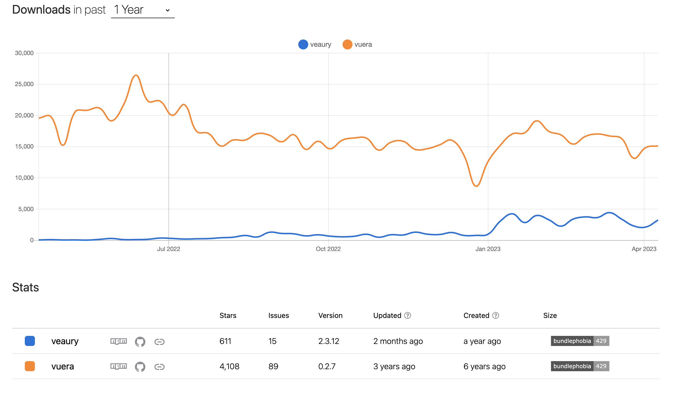

# 2. Document Plan for Migrating from Vue to React
<!-- markdownlint-disable MD033 -->

**Proposer**: Nat Hillard

**Date**: 2023-05-03

**Status**: proposed <!-- Proposed | Accepted | Rejected | Superceded -->

## 👀 Context and Problem Statement

> What problem are we solving? Who asked for it? Why is it important? When do they experience this issue? What data, research and feedback do we have that explains this problem?

If there are any documents that our partners have sent over, drop them here (if you drag it over the page, Notion will automatically upload and host the document.)
>

See Record [here](https://github.com/usdigitalresponse/usdr-gost/issues/1252) about moving from Vue to React more generally

We decided to spin out the question of when / how to move from Vue to React into its own separate ADR given how involved it is.

## 🚗 Decision Drivers

> What factors are important when making this decision? Think in the context of our product and audience.
>

- Onboarding learning curve for new volunteers
  - Considering the project can have a high turnover of volunteers, we want to minimize its complexity where we can and lower the learning curve to start contributing.
- Stable infrastructure
  - Technology architecture choices should aim for stability and reliability.
  - Third party libraries, frameworks used in project should be ones that are regularly maintained.
- Development work is within a reasonable distribution of resources
  - Achievable in a reasonable timeline
  - Achievable in the estimated timeline with the currently available human resources. (volunteers + USDR employees)

## 🤔 Considered Options

> What options have been considered? Include the proposed solution here as well
>

| Approach | Description | Pros | Cons | Example Implementations |
| --- | --- | --- | --- | --- |
| Hybrid | Integrate React into the Vue2 application using a library like vuera and replace Vue components with React components one at a time. | - Incremental migration  - Prioritization of components | <ul><li>Increased complexity</li><li>Potential performance issues</li><li>Longer overall migration time</li><li>Vuera is not actively maintained, react-vue is pretty old</li></ul> | <https://github.com/akxcv/vuera> (not maintained), <https://github.com/SmallComfort/react-vue> (pretty old), <https://github.com/devilwjp/veaury> (vue3-only) |
| Wrapper Component | Use a Vue component to wrap React. | Fast and easy | <ul><li>Complexity due to maintaining both Vue and React code</li><li>perf impact of rendering may be visible</li></ul> | N/A |
| Micro Frontends | Break the application into smaller, independent pieces (micro frontends) and migrate each piece to React. Develop and deploy each part independently while keeping the overall application running. | <ul><li>Independent deployment and development</li><li>Better separation of concerns between solutions</li></ul> | <ul><li>Significant complexity</li><li>this took quite some time to setup locally and even then took some time</li><li>Potential performance issues</li><li>Requires a good understanding of both Vue and React</li><li>Relatively new approach</li></ul> | single-spa.; Webpack Module Federation; Vite Module Federation |
| Framework-Agnostic Component framework | Use Astro, a front-end framework that allows you to use multiple front-end libraries together (like Vue and React) to build the application.  | <ul><li>Incremental migration</li><li>Supports multiple front-end libraries</li><li>Improved performance due to optimized builds</li></ul>| <ul><li>Relatively new framework</li><li>Requires learning Astro's syntax and best practices</li></ul> | <https://astro.build/> </ul>|
| New Branch/Repo | Create a separate branch or repository for the React version of your application. Develop the React version alongside the Vue version, and once the React version is complete and tested, switch over to it. Potentially use a router to drive traffic between the two apps | <ul><li>Clear separation between Vue and React code</li><li>Easier to manage and test</li></ul> | <ul><li>Requires more upfront development work</li><li>May require additional resources to maintain both versions</li></ul>| N/A |

## 💭 Proposal

> Which of the above options is bring proposed?
>

Use a new branch / repo to develop the new screens.

- Single-spa: While a semi-standard solution for this problem, is exceedingly difficult and time consuming to setup, and optimized for the case where there are multiple teams that need independent timelines to contribute.
- Wrapper components are too hacky and contain too many risks
- Vuera/Vueary - There is low usage on these in general

    

- Astro would require too many changes to our existing configuration and components
- Overall new screens are relatively contained - we do need to capture some existing functionality but the hope is we can port as we go

## 🔄 Phases

> How do you propose we roll this solution out over time and begin to incorporate it into our current codebase? Are there intermediary steps?
>
1. Phase 1: Starting Week of Apr 18 - Create new repository for React code, using standard React+Next.js setup
2. Phase 2: Apr 18 → Apr 24 - Devise a solution for intra-app routing between screens
3. Phase 3: Apr 24 → June 30 - Develop new screen against new repository
4. Phase 4: Post June 30 - Port features over as we come across them

## ℹ️ References / More Info

> Where can we go to read more information about the option being proposed?
>

## Code Examples

See [this PR](https://github.com/usdigitalresponse/usdr-gost/pull/1278) for an example implementation
