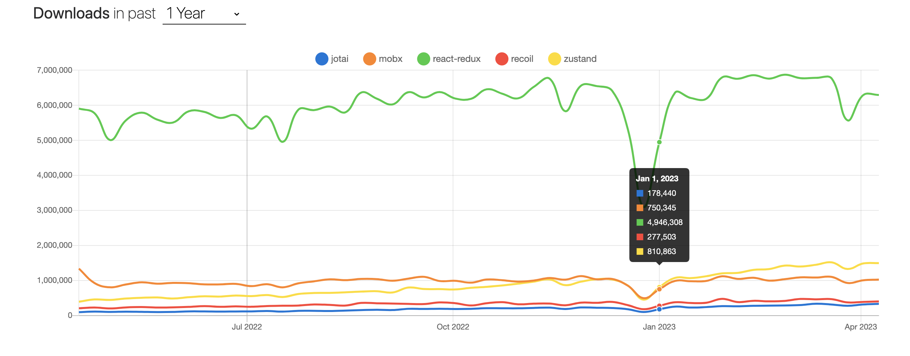
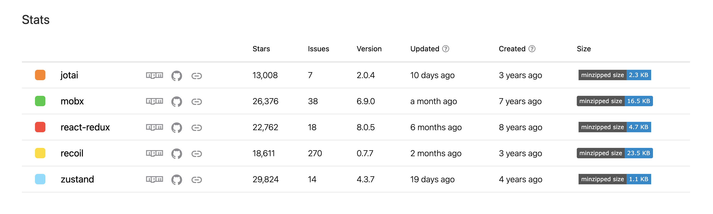

# 2. Use Redux for State Management
<!-- markdownlint-disable MD033 -->

**Date**: 2023-05-03

**Proposer**: Sam Behrens

**Status**: proposed <!-- Proposed | Accepted | Rejected | Superceded -->

## 👀 Context and Problem Statement

> What problem are we solving? Who asked for it? Why is it important? When do they experience this issue? What data, research and feedback do we have that explains this problem?

If there are any documents that our partners have sent over, drop them here (if you drag it over the page, Notion will automatically upload and host the document.)
>

With the migration from [Vue to React](https://www.notion.so/WIP-Document-Plan-for-Migrating-from-Vue-to-React-30fbcf3f9af443b0843aa77c469eea29) we need to rethink how the state will be managed in this new React app since the two libraries manage and treat state differently. The React library does not prescribe a state library, so several great open-source state libraries exist. We need to weigh the options and decide what suits our application best. The following libraries will be discussed initially chosen by their popularity: Redux, mobX, Zustand, and Jotai. Recoil will not be considered because it is still experimental.

<aside>
📌 Global state management specifically tries to solve the problem of managing state when there are frequent updates, various use cases, screens, and potential redesigns.  The React context API will not be discussed because it primarily serves to avoid prop drilling and does not solve managing large-scale application state.

</aside>

## 🚗 Decision Drivers

> What factors are important when making this decision? Think in the context of our product and audience.
>

- **Stability -** Is this project actively maintained with well-documented changes and releases?
- ****************Adoption / Community -**************** Is the project widely adopted in the industry and has good community support around issues as they arise?
- ********Ecosystem / Tooling -******** Are there other libraries that enhance the development experience or solve adjacent problems with this library?

## 🤔 Considered Options

> What options have been considered? Include the proposed solution here as well
>

Additional information on the libraries discussed

- [Redux](https://redux.js.org/) and [React-redux](https://react-redux.js.org/) :
  - Built around the [Flux architectural pattern,](https://www.freecodecamp.org/news/an-introduction-to-the-flux-architectural-pattern-674ea74775c9/) Redux is one of the oldest and most popular state libraries available. Although the library is framework agnostic, it is most often used with React applications. Dan Abramov, a core member of the React team, also developed it.
- [Mobx](https://mobx.js.org/)
  - ****Mobx is also another older library that is framework agnostic. Its build around [reactive programming principles](https://levelup.gitconnected.com/the-principles-behind-mobx-and-reactive-programming-4c43e73742e7) and uses the OOP paradigm with observables.
- [Zustand](https://docs.pmnd.rs/zustand/getting-started/introduction):
  - Zustand is a lightweight library based on Flux principles. It uses hooks, has minimal boilerplate, and has a streamlined API. This library only can work with React.
- [Jotai](https://jotai.org/):
  - Jotai subscribes to the atomicity principle, where every state slice can be composed as an atom, and those atoms can be chained together and subscribed to by components.  This library is similar to the experimental library currently being developed by Meta called Recoil.

| Library | Stability | Adoption/Community | Ecosystem/Tooling | Additional Pros | Additional cons  |
| --- | --- | --- | --- | --- | --- |
| Redux | <ul><li>updated and regularly maintained</li><li>widespread adoption</li></ul> | <ul><li>Has its own tag on Stackoverflow with thousands of questions</li><li>Most popular state management library</li></ul> | <ul><li>Has a browser extension for debugging: <https://redux-toolkit.js.org/></li><li><https://redux.js.org/introduction/ecosystem></li></ul> | <ul><li>straightforward to learn</li><li>library agnostic. if we move away from React, we can continue using redux</li><li>flexible and feature-rich</li></ul> | <ul><li>Has a lot of boilerplate</li></ul> |
| Mobx | <ul><li>Second most used state management library</li><li>actively maintained by a group of open-source contributors and supported by the Mendix Company</li></ul> | <ul><li>Has its own tag on StackOverflow with thousands of questions</li><li>second most used library to redux</li></ul> | <ul><li><https://github.com/xgrommx/mobx-ecosystem></li></ul> | <ul><li>library agnostic</li></ul> | <ul><li>must learn the [Reactive Extensions for JavaScript](https://angular.io/guide/rx-library) for the app to work</li></ul> |
| Zustand | <ul><li>Actively maintained with regular updates</li></ul> | <ul><li>With 1.5M downloads a week and 29k stars on GitHub, it is seen as an excellent alternative to redux</li></ul> | <ul><li>Can use Redux toolkit</li><li><https://docs.pmnd.rs/zustand/integrations/third-party-libraries></li></ul> | <ul><li>Very lightweight library that also uses Flux</li></ul> | <ul><li>suited for smaller, straightforward apps</li></ul> |
| Jotai | <ul><li>Regularly maintained and released</li></ul> | <ul><li>300k downloads a week</li></ul> | <ul><li>includes devtools</li><li>has a small set of integrations it can support</li></ul> | <ul><li>small and streamlined API</li><li>similar to react API, so onboarding is straightforward</li></ul> | <ul><li>Unclear if this library or recoil will be widely adopted as they are similar</li></ul> |

## 💭 Proposal

> Which of the above options is bring proposed?
>

e.g. *"{title of option 1}", because
{justification. e.g., only option, which meets k.o. criterion decision driver | which resolves force {force} | … }.*

Redux or Zustand would be a good option for future state management. These libraries are well-supported and easy to ramp up on. They are also widely popular, and new volunteers who have worked in React will have had experience with them.

Of those two, I lean towards Redux because it supports larger complicated applications and is very mature. Although it requires a lot of boilerplate, it is relatively easy to learn and has lots of resources to tackle issues. Additionally, if we ever decide to move away from React for whatever reason, redux is library agnostic, so we can keep our state management layer.

### Why not Jotai or Mobx?

The reason for not choosing Mobx is because the RxJS API is difficult to learn with a lot of onboarding time.

Jotai is similar and in competition with Meta's experimental library Recoil, and it’s unclear if the community will eventually favor Recoil. Additionally, atomic state management is a fairly new concept, and might take a while to ramp up on it.

## 🔄 Phases

> How do you propose we roll this solution out over time and begin to incorporate it into our current codebase? Are there intermediary steps?
>

The phases of the adoption of this new state management library depend on the decisions discussed in [[WIP] Use React for Frontend Development](https://github.com/usdigitalresponse/usdr-gost/pull/1312) and [[WIP] **Document Plan for Migrating from Vue to React**](https://github.com/usdigitalresponse/usdr-gost/issues/1204) . This section will have to be determined.

## ℹ️ References / More Info

> Where can we go to read more information about the option being proposed?
>
- [Redux vs Zustand](https://www.notion.so/Design-Efforts-Grants-2-0-MVP-2ddb9e87f33f4df0921b84d34f370e05)
- [The best state management tools for enterprise applications](https://www.notion.so/WIP-State-management-1ccff6b630894709bdc394aac560e81d)
- [Using Jotai with Next.Js](https://www.notion.so/blog-post-on-integrating-into-GOST-f0b7e884185f4b58ad49fb9eb830f9f6)
- [Zustand vs. React: what is the best library for your app?](https://www.frontendmag.com/insights/zustand-vs-redux-comparison/#Learning_Curves)
