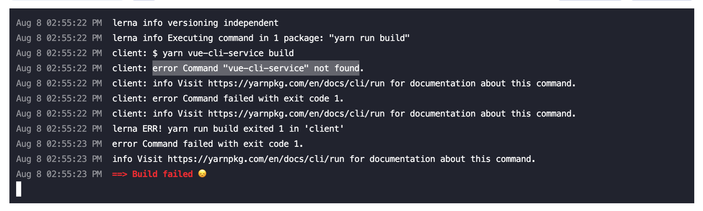

# Deployment

(Note, as of Mar 12, 2023, information in this file needs updating to account for the new AWS-based deployment process)

## Render

1. Create web service

   

2. Create database

   

3. Update web service environment variables

   

   **NOTE:** Don't set `NODE_ENV=production` else NPM dev deps will not be installed and prod deployments will fail [(source)](https://github.com/vuejs/vue-cli/issues/5107#issuecomment-586701382)

   

   ```sh
   POSTGRES_URL=<POSTGRE_CONNECTION_STRING> # Render Internal connection string ie postgres://cares_opportunity_user:<pass>@<domain>/cares_opportunity_1e53

   COOKIE_SECRET=<RANDOM_ALPHANUMERIC_SECRET>

   WEBSITE_DOMAIN=<WEB_SERVICE_URL> # Render web service url ie. https://cares-grant-opportunities-qi8i.onrender.com

   NODE_ENV=development or production or test

   NOTIFICATIONS_EMAIL="grants-identification@usdigitalresponse.org"
   SES_REGION="us-east-1"
   AWS_ACCESS_KEY_ID=<AWS_ACCESS_KEY_ID>
   AWS_SECRET_ACCESS_KEY=<AWS_SECRET_ACCESS_KEY>

   ENABLE_GRANTS_SCRAPER=true
   GRANTS_SCRAPER_DATE_RANGE=7 # date range of grants that will be scraped
   GRANTS_SCRAPER_DELAY=1000 # delay in milliseconds for scraper

   NODE_OPTIONS=--max_old_space_size=1024 # increase node max memory, had problems with node not using all of renders server memory. This will depend on the plan
   ```

## DB Migrations

1. Get the postgres external connection string from render. Set it as an environment variable

   `export POSTGRES_URL="postgres://user:{pass}@{domain}/{db}?ssl=true"`

   NOTE: must add `?ssl=true`

1. Change directory to packages/server

1. Update seeds/dev files accordingly
   - seeds/dev/ref/agencies.js - list of agencies to be created. You can update this with the state provided agency. Note: We add a special USDR agency for our accounts in the system
   - seeds/dev/index.js - Update the admin list variable accordingly

1. Run the following commands

   ```sh
   npx knex migrate:latest
   npx knex seed:run
   ```

   After that you should be able to access the site and login with the users set in the migration.
