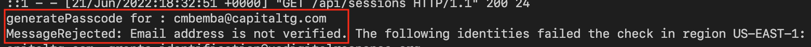

# Development

- [Development](#development)
  - [Workspaces](#workspaces)
  - [Running Code](#running-code)
    - [Docker](#docker)
    - [Local](#local)
  - [Linting](#linting)
    - [VSCode](#vscode)
    - [IntelliJ](#intellij)
  - [Debugging](#debugging)
    - [Chrome](#chrome)
  - [Styling](#styling)

As mentioned in the [Getting Started](../docs/getting-started.md) guide, there are two ways to set up this repository for development:

- Using Docker
- Using a local environment

The Docker-based method is generally preferred.

That said, instructions for running the app for development purposes are different depending on which method you choose.

## Workspaces

We make use of yarn workspaces in this project, read more [here](./workspaces.md) about how to set up and work with them.

## Running Code

### Docker

See [here](../docker/README.md) for more information about commands to use when developing locally with docker.

### Local

1. Run Client (Terminal 1)

   Now you should be able to serve the frontend.

   ***Ensure you are using the correct node version and are in the project root directory***

   ```sh
   yarn start:client
   ```

1. Run Server (Terminal 2)

   Now you should be able to serve the backend.

   **NOTE:** update `WEBSITE_DOMAIN` in `.env` to your client endpoint from Step 6 else When you get the login email link, change the redirected path from `localhost:8000/api/sessions/...` to your client_url e.g `localhost:8080/api/sessions/`

   ***Ensure you are using the correct node version and are in the project root directory***

   ```sh
   yarn start:server
   ```

   **NOTE:** if error references AWS (see screenshot below) then run `> unset AWS_ACCESS_KEY_ID`. The application will try to use AWS Simple Email Service (SES) if `AWS_ACCESS_KEY_ID` is found as an env var.

   

1. Visit `client_url/login` (e.g <http://localhost:8080/#/login>) and login w/ user `grant-admin@usdigitalresponse.org`.

   **NOTE:** if you only see a blank screen then ensure you've set up the `packages/client/.env`

   **NOTE:** if you get `Error: Invalid login: 534-5.7.9 Application-specific password required.` then you'll need to set an App Password (<https://myaccount.google.com/apppasswords>) (See Step 4)

## Linting

### VSCode

Open the repository using the workspace file `usdr-gost.code-workspace`. You will be prompted tp install recommended VSCode plugins located in `.vscode/extensions.json` for Vue and Eslint support.

To enable linting on save, a settings section has been included in the workspace which sets the appropriate linting options.

### IntelliJ

After installing depedencies, IntelliJ should start using eslint automatically:

> By default, IntelliJ IDEA marks the detected errors and warnings based on the severity levels from the ESLint configuration
> <https://www.jetbrains.com/help/idea/eslint.html#ws_js_linters_eslint_install>

## Debugging

### Chrome

Install Vue Dev Tools to help with debugging: <https://chrome.google.com/webstore/detail/vuejs-devtools/nhdogjmejiglipccpnnnanhbledajbpd?hl=en> .

See also:

- [How to set up client debugging using Google Chrome browser](https://github.com/usdigitalresponse/usdr-gost/wiki/How-to-set-up-client-debugging-using-Google-Chrome-browser)
- [How to set up server debugging using Google Chrome browser](https://github.com/usdigitalresponse/usdr-gost/wiki/How-to-set-up-server-debugging-using-Google-Chrome-browser)

## Styling

For guidance on how to use the USDR Design System styles in this app, please refer to our [frontend style guidelines](./styling.md).