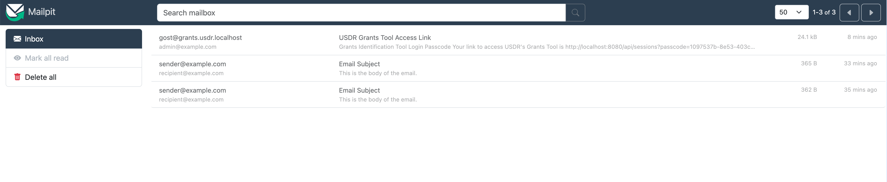
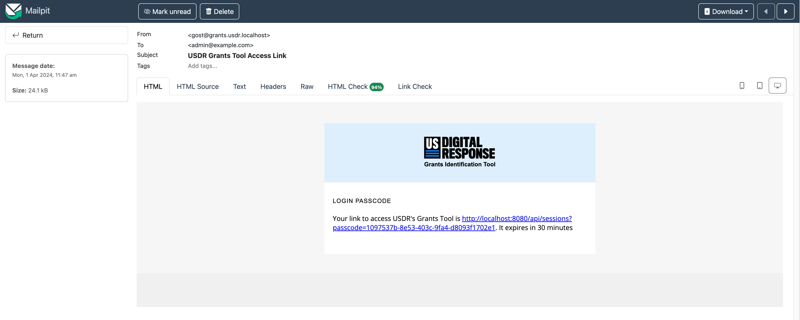
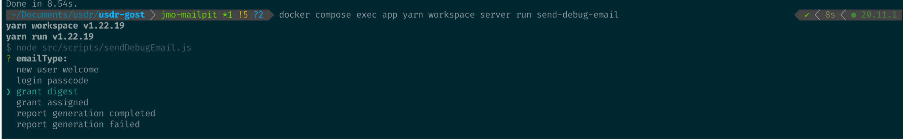
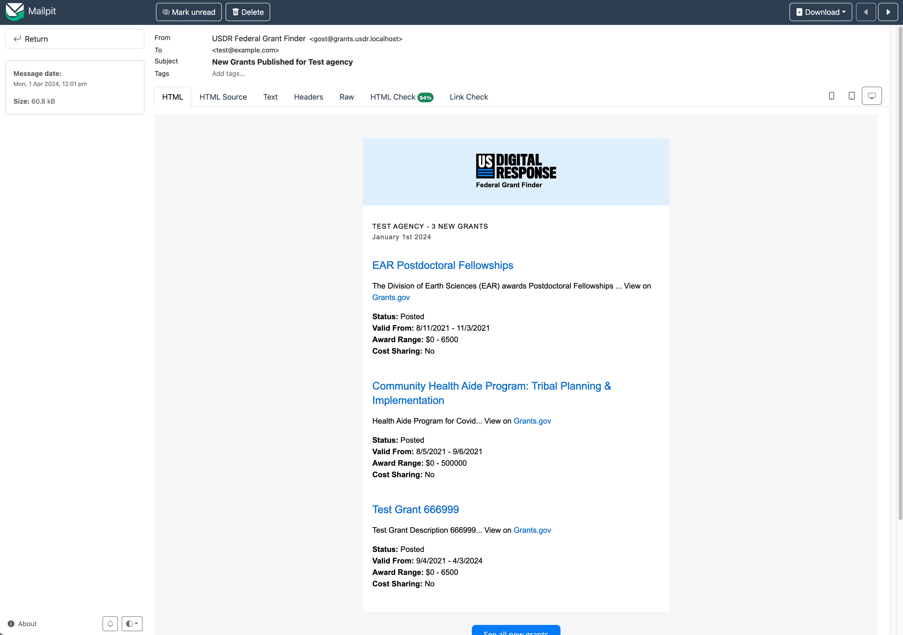

# Email Setup

## Mailpit Usage (outgoing email capture and viewing)

Mailpit is an SMTP sandbox service, which should already be running if you set up [via Docker](../docker/README.md). Emails the system sends are "trapped" by this service so you can view them in a web UI. This ensures your development setup will never actually send anything outbound, making it a safe way to test email sending in development. 

Once you trigger an email (for example, by sending a login email from http://localhost:8080/login) you can view the email in the Mailpit web UI by going to http://localhost:8025/.

Mailpit's web UI also offers helpful utilities for viewing HTML source, checking basic mail client compatibility, and more. 

## Send Debug Email

If you need to work on changes to emails (e.g., a grant digest email), it can be complex to trigger them in development. To simplify development, you can use the `send-debug-email` command: 

`docker compose exec app yarn workspace server run send-debug-email`

## Gmail Setup (DANGER — live email environment)

> [!WARNING]
> Gmail setup is generally not required for local development. Note that with this setup you will send real emails — please ensure you don't have real external email addresses in your database that you could accidentally mail. Please revert these environment variables to disable email sending anytime you're not actively intending to send real email.

Users log into the app by means of a single-use link that is sent to their email. In order to set your app up to send this email, you'll need to setup an App Password in Gmail.

Visit: <https://myaccount.google.com/apppasswords> and set up an "App Password" (see screenshot below). *Note: Select "Mac" even if you're not using a Mac.*

In `packages/server/.env`, set `NODEMAILER_EMAIL` to your email/gmail and set your `NODEMAILER_EMAIL_PW` to the new generated PW.

**Note:** Environment variable changes will require rebuilding your docker container to be picked up. 

**NOTE:** In order to enable App Password MUST turn on 2FA for gmail.

If running into `Error: Invalid login: 535-5.7.8 Username and Password not accepted.` then ["Allow Less Secure Apps"](https://myaccount.google.com/lesssecureapps) - [source](https://stackoverflow.com/a/59194512)

**NOTE:** Much more reliable and preferable to go the App Password route vs Less Secure Apps.

