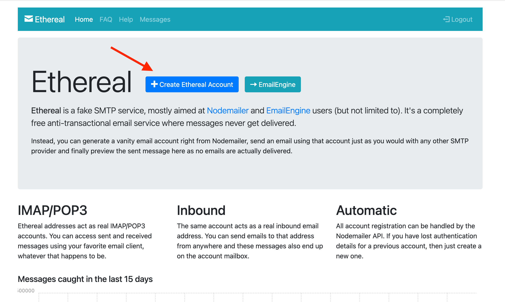
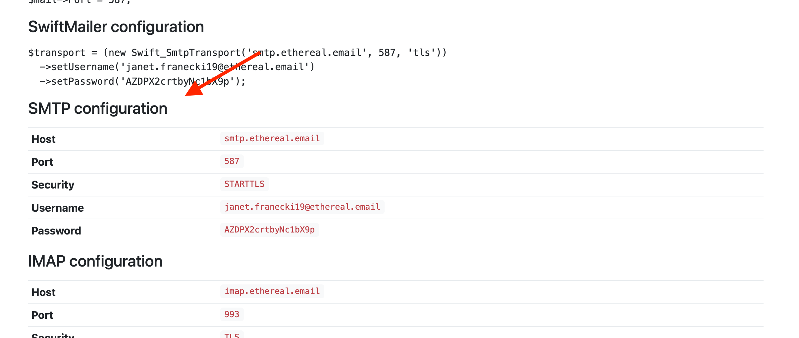
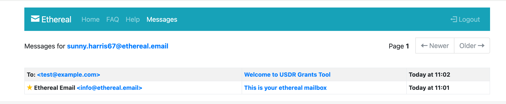
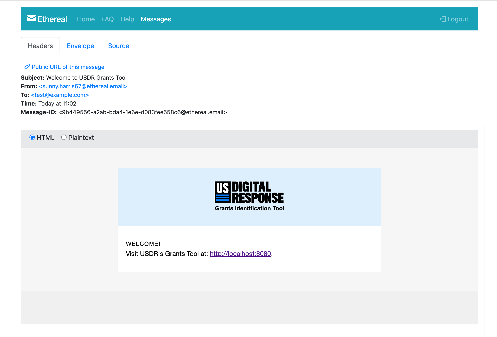
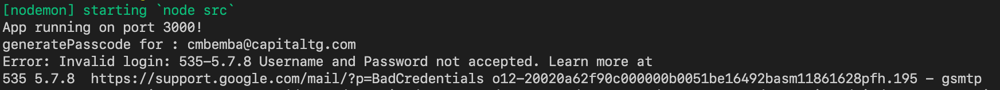

# Email Setup

## Ethereal Mail Setup (sandboxed email environment)

[Ethereal](https://ethereal.email/) is the recommended way to set up your development environment to work on emails. 

Ethereal is a free "fake" SMTP sandbox service. You can instantly create a temporary email account that pretends it can send and receive emails. Emails received and "sent" by this temporary account can be viewed in the messages inbox, but the address will never actually send anything outbound. This makes it a much safer way to test email sending in development. 

1. Go to [Ethereal](https://ethereal.email/) and click "Create Ethereal Account". 

   

2. Find the SMTP Configuration details for the new account on the created page. 

   

3. Update your `NODEMAILER_*` environment variables in your `server/.env` file with the SMTP details. 
   - `NODEMAILER_HOST=smtp.ethereal.email`
   - `NODEMAILER_PORT=587`
   - `NODEMAILER_SECURE=false` — Ethereal doesn't use a secure SMTP connection, so you'll turn secure off here
   - `NODEMAILER_EMAIL={{ email }}` — set the new email address from Ethereal's SMTP details here
   - `NODEMAILER_EMAIL_PW={{ password }}` — set the new password from Ethereal's SMTP details here
4. Rebuild your app docker container so it picks up the new environment variables
   - `docker compose down app`
   - `docker compose up -d`
5. Use the send debug email tool to send a demo of any email type for your Ethereal email to capture
   - `docker compose exec app yarn workspace server run send-debug-email`
6. Click over to the "Messages" tab on Ethereal to see your inbox and view the message

   
   

## Gmail Setup (DANGER — live email environment)

> [!WARNING]
> Gmail setup is generally not required for local development. Note that with this setup you will send real emails — please ensure you don't have real external email addresses in your database that you could accidentally mail. Please revert these environment variables to disable email sending anytime you're not actively intending to send real email.

Users log into the app by means of a single-use link that is sent to their email. In order to set your app up to send this email, you'll need to setup an App Password in Gmail.

Visit: <https://myaccount.google.com/apppasswords> and set up an "App Password" (see screenshot below). *Note: Select "Mac" even if you're not using a Mac.*

In `packages/server/.env`, set `NODEMAILER_EMAIL` to your email/gmail and set your `NODEMAILER_EMAIL_PW` to the new generated PW.

**Note:** Environment variable changes will require rebuilding your docker container to be picked up. 

**NOTE:** In order to enable App Password MUST turn on 2FA for gmail.

If running into `Error: Invalid login: 535-5.7.8 Username and Password not accepted.` then ["Allow Less Secure Apps"](https://myaccount.google.com/lesssecureapps) - [source](https://stackoverflow.com/a/59194512)

**NOTE:** Much more reliable and preferable to go the App Password route vs Less Secure Apps.

