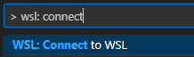
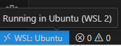
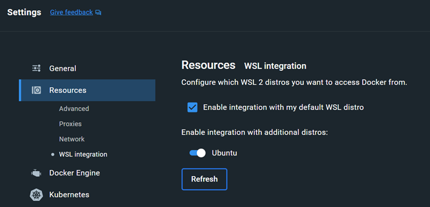
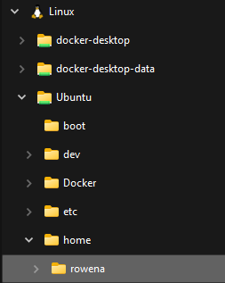

# Setup - Windows

See below for how to set up your development environment in Windows. You'll be installing Windows Subsystem for Linux (WSL 2), Docker, and the WSL extension for Visual Studio Code. This allows you to run a Linux environment directly on Windows and enables full use of Docker for running the app.

* Requires: *Some Linux command line familiarity*  
* Takes: *A few hours depending on your machine and network connection (more if you hit errors). Requires multiple reboots.*

These steps are for an install on a Windows machine. Mac instructions are [here](./setup-mac.md).

## Install

1. Follow these instructions to [install Windows Subsystem for Linux](https://github.com/usdigitalresponse/usdr-gost/wiki/How-to-create-an-Ubuntu-instance-in-Windows-Subsystem-for-Linux).

2. [Install Docker Desktop for Windows](https://docs.docker.com/desktop/install/windows-install/) - note system requirements
  * Take defaults.
  * Run Docker Desktop and accept license.
  * Let it start. You can continue without signing in.
  * Restart Ubuntu terminal and verify the Docker installation:

    ```sh
    $ docker --version
    ```

    You should see a version and build as the output.

3. Install [Visual Studio Code](https://code.visualstudio.com/) if needed.

## Set up WSL with VS Code and Docker
### VS Code
1. In VS Code, install the [WSL extension](https://marketplace.visualstudio.com/items?itemName=ms-vscode-remote.remote-wsl) from Marketplace. This allows you to run VS Code in the WSL environment just as you would in Windows.

2. Start typing into the search bar/command palette: `> WSL: Connect to WSL`. Select the command that comes up:



3. After that runs, VS Code will reopen in Ubuntu, as indicated by the status bar:



VS Code will remember this setting. If you want to exit WSL, go to the search bar and type `Close Remote Connection`.

### Docker
To enable WSL integration with Docker:
- Go to Settings (in the header) > Resources > WSL Integration
- Check off "Enable integration with my default WSL distro" and toggle on "Ubuntu" (it should be there if you have it installed - try the Refresh button if it isn't)
- Apply & restart
 

## Clone the repository
1. Now you'll create a folder in the Linux (Ubuntu) file system to clone the `usdr-gost` repo in. You should see the Ubuntu file system represented in your file explorer.

- Navigate to `\\wsl.localhost\Ubuntu\home\<Ubuntu-username>`.

Example:



- Within this folder, create a folder called `sources`. This is where you'll clone the repo.

> Note: If you've already cloned the repo in Windows, you can just move it to this `sources` folder.

2. Open the sources folder in VS Code and open up a Terminal. You should now be in `<Ubuntu-username>@<PC-name>:~/sources`

Example:


3. Clone the repo to `sources`:
- `git clone https://github.com/usdigitalresponse/usdr-gost.git`

4. Get your Docker containers set up with the [Docker instructions](../docker/README.md). You can also run the rest of the [platform-independent steps](https://github.com/usdigitalresponse/usdr-gost/wiki/Platform-independent-install-instructions), which refer to the Docker instructions.


## Notes

* After rebooting, you might have to run the Docker Desktop to start the Docker daemon (or add it to your startup as described [here](https://support.microsoft.com/en-us/windows/add-an-app-to-run-automatically-at-startup-in-windows-10-150da165-dcd9-7230-517b-cf3c295d89dd)).

* For further reference: [VS Code docs on developing in WSL](https://code.visualstudio.com/docs/remote/wsl)