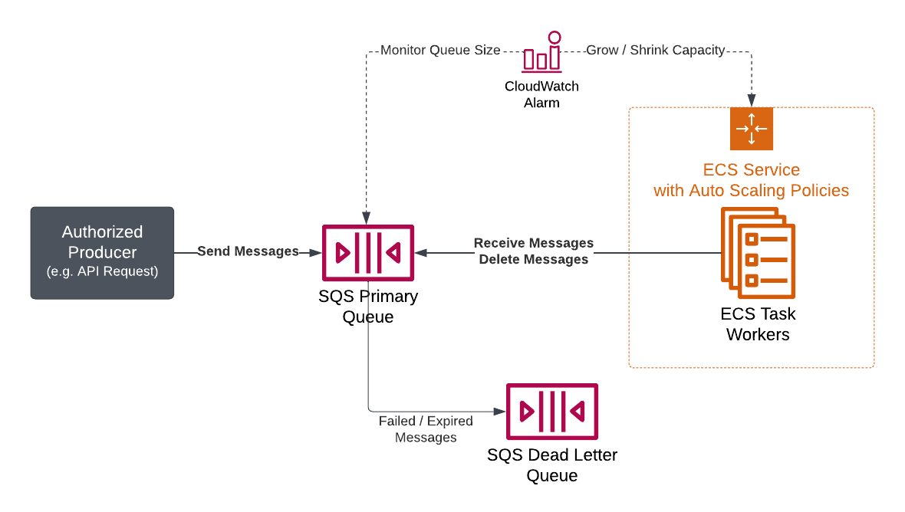

# SQS Consumer Task module

This module provides an SQS queue and an ECS service with tasks that act as "workers" responsible
for processing messages in the queue. In essence, it implements the "consumer" side of a 
producer-consumer pattern.

 

- [Naming](#naming)
- [Architecture](#architecture)
- [Components](#components)
  - [SQS Queues](#sqs-queues)
    - [Permissions Management](#sqs-permissions-management)
      - [Examples](#sqs-permissions-management-examples)
  - [ECS Workers](#ecs-workers)
    - [Resource Allocation](#resource-allocation)
    - [Permissions Management](#ecs-permissions-management)
      - [Examples](#ecs-permissions-management-examples)
    - [Consumer Execution](#consumer-execution)
      - [Environment Variables](#environment-variables)
      - [Startup Command](#startup-command)
      - [Shutting Down](#shutting-down)
      - [Autoscaling](#autoscaling)
        - [Examples](#autoscaling-examples)
  - [Observability](#observability)
    - [Datadog Configuration](#datadog-configuration)

## Naming

When using this module, provide a value to the `namespace` input variable that is prefixed
with the default namespace for the GOST service (configured in the environment-specific
`terraform/*.tfvars` files in this repository) and suffixed with the name of your consumer
task. For example, when implementing a consumer task called `my_worker` in `terraform/main.tf`:

```terraform
module "my_worker" {
  source = "./modules/sqs_consumer_task"
  # ...
  namespace = "${var.namespace}-my_worker"
}
```

Doing so will ensure that resources created by this module conform to the expectations of 
our AWS environments, and will also help avoid name collisions of resources belonging to the
GOST service.

## Components

### SQS Queues

A primary SQS queue is created for the purpose of retaining messages that are ready for work
(i.e. to be received by an ECS task worker and deleted once the work is completed successfully).
Optionally, an SQS dead-letter queue (DLQ) can be created via the `sqs_dlq_enabled` input 
variable (enabled by default) to store messages which fail to be  processed after a configured
number of attempts (specified by `sqs_max_receive_count`), or once the age of a message in
the source queue has elapsed a configured threshold (specified by `sqs_message_retention_seconds`).

DLQs provide an easy way to monitor for failures, inspect failed messages, and retry them
once a fix has been implemented. Therefore, **it is strongly recommended that you enable
the DLQ provided by this module** and that you configure a sensible retention period (via
the `sqs_dlq_message_retention_seconds` input variable) that affords enough time to detect,
debug, and fix any issues that cause tasks to fail.

#### Permissions Management <a name="sqs-permissions-management"></a>

This module configures the primary SQS queue policy to grant access for a publisher 
(i.e. the "producer" of work, which is not maintained by this module) to send messages to 
the queue. If a DLQ is created, it may only receive messages from the primary queue (see above).
The publisher is configured via the `sqs_publisher` input variable.

##### Examples <a name="sqs-permissions-management-examples"></a>

- Allow a specific IAM role to publish messages:
  - *Update the module source path, AWS account ID, and IAM role name according to your use-case!*
  ```terraform
  module "my_worker" {
    source = "/path/to/sqs_consumer_task"
    # ...
    sqs_publisher = {
      principal_type       = "AWS"
      principal_identifier = "arn:aws:iam::123456789876:role/my-publisher-role-name"
    }
  }
  ```
- Allow tasks running in a specific ECS service to publish messages:
  - *Update the module source path, AWS account ID, AWS region, ECS cluster name, and ECS 
    service name according to your use-case.*
  ```terraform
  module "my_worker" {
    source = "/path/to/sqs_consumer_task"
    # ...
    sqs_publisher = {
      principal_type       = "Service"
      principal_identifier = "ecs-tasks.amazonaws.com"
      source_arn           = "arn:aws:ecs:us-west-2:123456789876:service/my-ecs-cluster-name/my-publisher-service-name"
    }
  }
  ```
- Allow an AWS EventBridge rule to publish messages:
  - *Update the module source path, AWS account ID, AWS region, and EventBridge rule name 
    according to your use-case.*
  ```terraform
  module "my_worker" {
    source = "/path/to/sqs_consumer_task"
    # ...
    sqs_publisher = {
      principal_type       = "Service"
      principal_identifier = "events.amazonaws.com"
      source_arn           = "arn:aws:events:us-west-2:123456789876:rule/my-publisher-rule-name"
    }
  }
  ```
- Allow any principal identity in an AWS account to publish messages:
  - **Not recommended; this should only be used for testing.**
  - *Update the module source path, AWS account ID, AWS region, and EventBridge rule name 
    according to your use-case.*
  ```terraform
  module "my_worker" {
    source = "/path/to/sqs_consumer_task"
    # ...
    sqs_publisher = {
      principal_type       = "Service"
      principal_identifier = "events.amazonaws.com"
      source_arn           = "arn:aws:events:us-west-2:123456789876:rule/my-publisher-rule-name"
    }
  }
  ```

### ECS Workers

An ECS service and fargate task (i.e. the "consumer" of work) is created for the purpose of 
consuming  messages from the source queue, performing necessary work informed by each message, 
and deleting  the message once the work is completed successfully. Note that receipt and deletion
activities are the responsibility of the process executed within the ECS task, and will not
happen automatically – you must ensure that your code is written to poll messages (either
individually or in a batch), perform necessary work, and subsequently delete each message 
unless an error was encountered.

Since failures may be temporary, you should use the `sqs_max_receive_count` input variable
to configure a sensible limit for the number of times a message may be retried before it is 
sent to the DLQ. Additionally, make sure to configure the `sqs_visibility_timeout_seconds` 
duration with enough time for tasks to complete necessary work before the message-receive 
operation is considered to have failed, at which point the associated message will appear 
back in the primary queue for reprocessing, or else be sent to the DLQ or disappear entirely 
(depending on whether the DLQ is enabled via the `sqs_dlq_enabled` input variable).

#### Resource Allocation

ECS Fargate tasks must be configured with a task size that specifies the total available 
CPU and memory allocated to each task, which can be set via the `consumer_task_size` input
variable. Both `cpu` and `memory` values are required, and must correspond to a valid Fargate
configuration, which are documented in the **Task Size** section of [this page][ecs-task-size-doc]
in the ECS Developer Guide.

[ecs-task-size-doc]: https://docs.aws.amazon.com/AmazonECS/latest/developerguide/task_definition_parameters.html#task_size

#### Permissions Management <a name="ecs-permissions-management"></a>

ECS service tasks are automatically provisioned with permissions that grant access to the
GOST Postgres database cluster, write logs to CloudWatch, and consume messages and delete
messages from the primary SQS queue. Additional permissions may be granted as well, either
by providing JSON policy documents via the `additional_task_role_json_policies` input variable,
or by creating additional policies and attaching them to the task role with 
`aws_iam_role_policy_attachment` resources outside of this module.

##### Examples <a name="ecs-permissions-management-examples"></a>

- Allow tasks to read and write objects in an S3 bucket:
  ```terraform
  data "aws_iam_policy_document" "read_and_write_to_my_bucket" {
    statement {
      sid = "ReadWriteBucketObjects"
      actions = [
        "s3:GetObject",
        "s3:PutObject",
      ]
      resources = [
        "arn:aws:s3:::my-bucket/*",
      ]
    }
  }
  module "my_worker" {
    source = "/path/to/sqs_consumer_task"
    # ...
    additional_task_role_json_policies = {
      rw-my-s3-bucket = data.aws_iam_policy_document.read_and_write_to_my_bucket.json,
    }
  }
  ```
  
#### Consumer Execution

##### Environment Variables

Some environment variables are configured automatically and should not generally be overridden.
Additional environment variables that are specific to the consumer task should be provided via
the `consumer_container_environment` input variable.

For information on configuring environment variables pertaining to Datadog, refer to the
[Datadog Configuration](#datadog-configuration) section of this document.

##### Startup Command

A single command must be provided to use when starting the consumer container in an ECS task.
The ECS task will continue to run until the process initiated by this command exits.
The `consumer_task_command` input variable specifies the command. Its value is essentially
used as the `CMD` in the consumer Docker container, and as such, should be a list of strings
that execute the module responsible for consuming messages, for example:

```terraform
module "my_worker" {
  source = "/path/to/sqs_consumer_task"
  # ...
  consumer_task_command = ["node", "./src/scripts/myWorker.js"]
}
```

Note that paths are relative to the application working directory specified by the `WORKDIR`
option in the Dockerfile used to build the Docker image for the consumer container. Assuming
you are using the `ghcr.io/usdigitalresponse/usdr-gost-api` Docker image for your consumer,
you can refer to its Dockerfile, located at `docker/production-api.Dockerfile` in this repository,
for more details.

##### Shutting Down

Unless (and perhaps even if) the process initiated by `consumer_task_command` exits immediately 
after processing a single message, it will likely need to shut down gracefully when a `SIGTERM`
signal is sent by the host. This can happen for a variety of reasons, including during normal
autoscaling activities (such as when the pool of active tasks is being scaled down) or when
a task shutdown is otherwise requested in AWS. Once a `SIGTERM` signal is sent, a grace period
countdown begins to allow the process to end any in-progress activities and shut down gracefully.
By default, this period is 30 seconds, but this can be adjusted to anywhere from 0 to 120 seconds
via the `stop_timeout_seconds` input variable. If this period elapses and the process is still
running, a `SIGKILL` signal is sent by the host, which forcefully terminates the process and
its container.

The following code snippet (adapted from `packages/server/src/scripts/consumeGrantModifications.js`)
may serve as reference example for capturing these signals and implementing graceful shutdown
behavior in JavaScript (note that this example code treats both `SIGTERM` and `SIGINT` signals
as equivalent):

```javascript
async function main() {
    let shutDownRequested = false;
    const requestShutdown = (signal) => {
        shutDownRequested = true;
    };
    // Call requestShutdown() with the signal on SIGTERM or SIGINT
    process.on('SIGTERM', requestShutdown);
    process.on('SIGINT', requestShutdown);
    // Start the main loop that checks for messages containing work from SQS, then does the work.
    // Keep doing this as long as shutDownRequested remains false.
    while (shutDownRequested === false) {
        messages = await askSQSForWork();
        await doSomeWork(messages);
    }
}

if (require.main === module) {
    main().then(() => process.exit());
}
```

#### Autoscaling

This module provides the ability to automatically scale worker tasks in ECS based on the number
of messages that are available for processing in the primary SQS queue, which allows provisioning
of compute operations in a cost-effective manner. When the primary queue is empty, no tasks
will run in the ECS service. As more and more messages are published to the queue, additional
tasks are added to the ECS service up to a predefined maximum threshold. Individual thresholds
must be provided via the `autoscaling_message_thresholds` input variable in order to instruct
the module on how many worker tasks should be provisioned according to the primary queue size.

Please note the following aspects of this autoscaling behavior:
- Autoscaling always drops to zero tasks when the primary queue is empty.
- Autoscaling is not unbounded; the maximum number of worker tasks is always 1 greater than
  the number of list items defined in the `autoscaling_message_thresholds` input variable.
- Providing an empty list for `autoscaling_message_thresholds` will therefore autoscale
  to a single worker task whenever the primary queue contains at least 1 available message.

##### Examples <a name="autoscaling-examples"></a>

The following examples convey autoscaling behavior according to the `autoscaling_message_thresholds`
configuration:

- `autoscaling_message_thresholds = [10, 20, 30]`
  - 0 active tasks when the queue is empty 
  - 1 active task when the queue contains 1 to 10 messages
  - 2 active tasks when the queue contains 11 to 20 messages
  - 3 active tasks when the queue contains 21 to 30 messages
  - 4 active tasks when the queue contains more than 30 messages
- `autoscaling_message_thresholds = [50, 100, 500, 1000, 5000]`
  - 0 active tasks when the queue is empty 
  - 1 active task when the queue contains 1 to 50 messages
  - 2 active tasks when the queue contains 51 to 100 messages
  - 3 active tasks when the queue contains 101 to 500 messages
  - 4 active tasks when the queue contains 501 to 1,000 messages
  - 5 active tasks when the queue contains 1,001 to 5,000 messages
  - 6 active tasks when the queue contains more than 5,000 messages
- `autoscaling_message_thresholds = []` (empty list)
  - 0 active tasks when the queue is empty
  - 1 active task when the queue is not empty
- `autoscaling_message_thresholds = [1]`
  - 0 active tasks when the queue is empty
  - 1 active task when the queue contains 1 message
  - 2 active tasks when the queue contains more than 1 message
- `autoscaling_message_thresholds = [10]`
  - 0 active tasks when the queue is empty
  - 1 active task when the queue contains 1 to 10 message
  - 2 active tasks when the queue contains more than 10 messages

## Observability

This module provisions a dedicated CloudWatch log group for ECS service and task logs (which
are automatically forwarded to Datadog).

Each ECS task is provisioned with two containers:
1. The main "consumer" container, which executes the command (configured via the 
  `consumer_task_command` input variable) responsible for processing available messages
  from the primary SQS queue.
2. A Datadog container, which runs the `dd-agent` process and is responsible for collecting
  and sending runtime metrics, traces, and profiling data to Datadog.

### Datadog Configuration

Environment variables that enable and configure various datadog features (which are
generally prefixed with `DD_`) should be provided via the `datadog_environment_variables`
input variable. Additionally, unified service tag values must be provided via the
`unified_service_tags` input variable (you should use the same values that are provided
to all GOST modules' `unified_service_tags` input variable). Do **not** specify `DD_SERVICE`,
`DD_ENV`, or `DD_VERSION` environment variables; these are managed by `unified_service_tags`.
